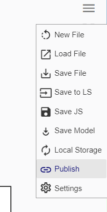

# Embedding Mobius Modeller
Creating a unique url for your Mobius Generative Script is easy.
The Url may be used to directly view the file in mobius modeller, or embedded in your webpage using HTML.

## Required
The .mob file will need to be a public resource stored in one of the following services:
1. GitHub (raw link)
1. AWS (s3 bucket public url)
1. Dropbox (public url)

## Basic Settings
1. Base URL:
    https://mobius-08.design-automation.net/

1. Determine whether the file should be editable to the viewer
    * editable: append `dashboard`
    https://mobius-08.design-automation.net/dashboard
    * uneditable: append `publish`
    https://mobius-08.design-automation.net/publish

1. Append the file url after `?file=`
    example (editable):
    https://mobius-08.design-automation.net/dashboard?file=https://raw.githubusercontent.com/design-automation-edu/AR2524-AY2021-Gallery/main/FinalProject/G1/student_00.mob

## Additional Settings
1. Available 3D viewers (Uneditable)
    * None: append `=&showViewer=0`
    * 3D Viewer Only: append `=&showViewer=1`
    * Geo Viewer Only: append `=&showViewer=2`
    * Both: default
1. Default left view-port tab (Editable)
    * Dashboard: default
    * Specific Node: append `=&node=` + node number
        example:
        https://mobius-08.design-automation.net/dashboard?file=https://raw.githubusercontent.com/design-automation-edu/AR2524-AY2021-Gallery/main/FinalProject/G1/student_00.mob=&node=1
1. Default Viewer
    * 3D Viewer: default
    * Geo Viewer: append `&defaultViewer=2`
    * Console Viewer: append `&defaultViewer=0`

## Interactive 
Alternatively, you may get the url through an interactive process on mobius modeller

## Embed in website
You may include the url in the `src` attribute of an iframe.
For more information: [MDN Web Docs Iframe](https://developer.mozilla.org/en-US/docs/Web/HTML/Element/iframe)
    <iframe 
        width='100%' 
        height='600px' 
        style='border: 1px solid black;' 
        src="https://mobius-08.design-automation.net/dashboard?file=https:%2F%2Fraw.githubusercontent.com%2Fdesign-automation-edu%2FAR2524-AY2021-Gallery%2Fmain%2FFinalProject%2FG1%2Fstudent_00.mob&node=0">
    </iframe>